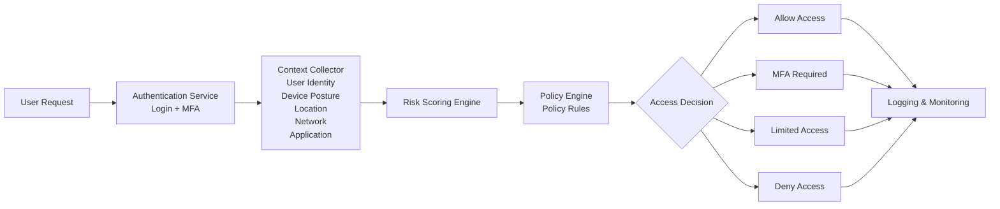

# Architecture Diagram

This diagram visualizes the request flow and components of the Context-Aware Access Control (Zero Trust) system.

## System Workflow

1. **User Request**: Initial attempt to access a resource.
2. **Authentication**: User logs in; MFA may be triggered here or later based on risk.
3. **Context Collection**: Gathering signals such as user role, device posture, location, etc.
4. **Risk Calculation**: The Risk Engine assigns a score based on context.
5. **Policy Evaluation**: The Policy Engine maps the risk score to a defined policy.
6. **Access Decision**: The final outcome (Allow, MFA, Limited, or Deny).
